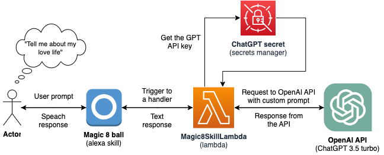

# Perspektywy women in tech summit 2023 workshop "From idea to implementation"

> This is a project presented during Perspektywy Women in Tech Summit 2023 in scope of workshop "From idea to implementation" led by Amazon Development Center Poland.

[git]:    https://git-scm.com/
[codecatalyst]: https://codecatalyst.aws/explore
[aws]: https://aws.amazon.com/free
[alexa-developer]: https://developer.amazon.com/alexa/console/ask
[cdk-toolkit]: https://docs.aws.amazon.com/cdk/v2/guide/cli.html

# Infrastructure

## SETUP
> How to configure your Alexa Skill

### Prerequisites

- [Git][git]
- [CodeCatalist acount][codecatalyst]
- [AWS account][aws]
- [Alexa developer account][alexa-developer]
- [AWS CDK Toolkit][cdk-toolkit]

### Fork the repository
Fork this repo to your GitHub account so you can use it later on in your CodeCatalist project.

### Set up project in CodeCatalist

- [Create you CodeCatalist account][codecatalyst]
- Click orange button in the upper right corner "Create project"
- Select "Bring your own code"
- Click "Connect GitHub account"
- Login to you GitHub account and Install Amazon CodeCatalyst on the forked repo

### Set Dev environment

 > Here I describe steps for Visual Studio Code but you can use editor of your choice

- Install [Visual Studio Code](https://code.visualstudio.com/)
- Install [AWS Toolkit for VS Code] (https://marketplace.visualstudio.com/items?itemName=AmazonWebServices.aws-toolkit-vscode)
- In your CodeCatalist project go to Code > Source repositories > [repositoryName] 
- Click button in the upper right corner "Create Dev Environment" > "Visual Studio Code" and follow the configuration in the pop up window

### Create environment for your workflow

This is required to connect your AWS account with your CodeCatalist project so you can deploy your changes through the workflow.

- Selcet CI/CD > Environments from the menu on the left hand side in your CodeCatalist workspace
- Click orange button in the upper right corner "Create environment"
- Give your environment a name and connect it with your AWS account

In order for your workflow to be able to run deployments you need to create the IAM role inside your AWS account. CodeCatalicy can automatically do it for you. In your environment select "AWS account connections" tab and click on you account number. Than click "Create the IAM role" button and follow to the AWS account.

You also need to switch the environment in your workflow to the newly created one.

- Selcet CI/CD > Workflows from the menu on the left hand side in your CodeCatalist workspace
- Select the "Workflow"
- Click "Edit" button in the upper right corner
- Switch the environemnt 
    - YAML: Replace the Role and the Name under the Environment > Connections section
    - Visual: On every step other than the source, go to "Configuration tab and switch the environment
- Click "Validate" button in the upper right corner to make sure your template is correct
- Click "Commit" to push your changes

### Create frontend for your Alexa skill

> I'm not able to export the frontend for the Alexa Skill so you have create you own based on the handlers provided inside the lambda code

- Create you [Alexa Developer account][alexa-developer]
- Click "Create skill"
- Select the name and the locale of yout choice
    > If you want to test it on your own device the skill need to be in the same locale as the device
- Choose a type of experience > "Other"
- Choose a model > "Custom"
- Hosting services "Provision your own" (as we will use our lambda)
- Templates "Start from scratch"
- Following the guide add missing intents: `LovePredictionIntent`, `WorkPredictionIntent`, `QuestionAnsweringIntent` and any other intents you want to add

#### Connect Lambda with the skill
- In the "Endpoint" section of your skill under "Service Endpoint Type" select "AWS Lambda ARN" and provdie the ARN of your lambda. Do not forget to save the changes!
- Copy `Your Skill ID`, you'll need it in the next step
- In you cdk in `lambda-stack.ts` file replace `eventSourceToken` with your skill ID
- Push the change (you can deploy it manually as well, but the workflow should deploy if for you after pushing the change)

### Provide the secret 
If you want to use chat GPT you need to create [Open AI account](https://platform.openai.com/signup) and generate your key. As a new user you will get 5$ of free trial usage.

The CDK code will create the secret for you but you need to go to the the AWS Console > Secrets Manager and set the value of your secret manually to `{"GPT_SECRET": "<your-own-chat-gpt-api-key>"}`.

## Useful commands

* `npm run build`   compile typescript to js
* `cdk deploy`      deploy this stack to your default AWS account/region
* `cdk diff`        compare deployed stack with current state
* `cdk synth`       emits the synthesized CloudFormation template

##  Other links and resources
### Amazon SageMaker Studio
- [Getting started with Amazon SageMaker](https://aws.amazon.com/sagemaker/getting-started/)
- [Get started with foundation models](https://aws.amazon.com/sagemaker/jumpstart/getting-started/)
- [Get Started with Your Machine Learning Project Quickly Using Amazon SageMaker JumpStart](https://aws.amazon.com/getting-started/hands-on/machine-learning-tutorial-get-started-with-your-project-quickly/)

### Amazon SageMaker MLOps tutorials

- [Automate Machine Learning Workflows](https://aws.amazon.com/getting-started/hands-on/machine-learning-tutorial-mlops-automate-ml-workflows/)
- [Deploy a Machine Learning Model to a Real-Time Inference Endpoint](https://aws.amazon.com/getting-started/hands-on/machine-learning-tutorial-deploy-model-to-real-time-inference-endpoint/)
- [Amazon SageMaker architectures of different scale explained](https://www.youtube.com/watch?v=UnAN35gu3Rw)

### Amazon Workshops

- [DevOps](https://workshops.aws/categories/DevOps)
- [Operationalizing the Machine Learning Pipeline](https://catalog.us-east-1.prod.workshops.aws/workshops/44d3e2a0-ec6f-44df-9397-bcfdf129cadf/en-US/module-introduction-1/architecture-1-2)

#### Think SER-VER-LESS
- [Serverless workflow collection](https://serverlessland.com/workflows)

#### Make use of FREE TIER 
- [Amazon SageMaker Free Tier](https://aws.amazon.com/sagemaker/pricing/)

#### Prebuilt SOLUTIONS, Blueprints, AWS SDK, AWS SAM, AWS CloudFormation 
- [AWS Solutions library](https://aws.amazon.com/solutions/?nc1=f_cc)
- [SageMaker prebuilt solutions](https://docs.aws.amazon.com/sagemaker/latest/dg/jumpstart-solutions.html)
- [Code examples](https://aws.amazon.com/developer/code-examples)
- [SDK code examples](https://docs.aws.amazon.com/code-library/latest/ug/code_example_library_by_service.html)
- [Blueprints](https://codecatalyst.aws/explore/blueprints)

#### NEW products
- [Amazon CodeWhisperer](https://aws.amazon.com/codewhisperer/resources/#Getting_started/)
- [Amazon Aurora I/O Optimized](https://aws.amazon.com/about-aws/whats-new/2023/05/amazon-aurora-i-o-optimized/)

### pricing & monetization
- [AWS Pricing](https://aws.amazon.com/pricing/?aws-products-pricing.sort-by=item.additionalFields.productNameLowercase&aws-products-pricing.sort-order=asc&awsf.Free%20Tier%20Type=*all&awsf.tech-category=*all)
- [AWS Pricing calculator](https://calculator.aws/#/?ch=cta&cta=lower-pricing-calc)
- [Alexa Skills Kit (Earn Money with a Skill)](https://developer.amazon.com/en-US/docs/alexa/custom-skills/sell-products-in-an-alexa-skill.html)
- [Alexa Paid Skills](https://developer.amazon.com/en-US/docs/alexa/paid-skills/overview.html)
- [Understand In-Skill Purchasing](https://developer.amazon.com/en-US/docs/alexa/in-skill-purchase/isp-overview.html)
- [Alexa Skill Deals](https://developer.amazon.com/en-US/docs/alexa/skill-deals/overview.html)
- [Alexa Skills Store](https://www.amazon.com/alexa-skills/b?ie=UTF8&node=13727921011)